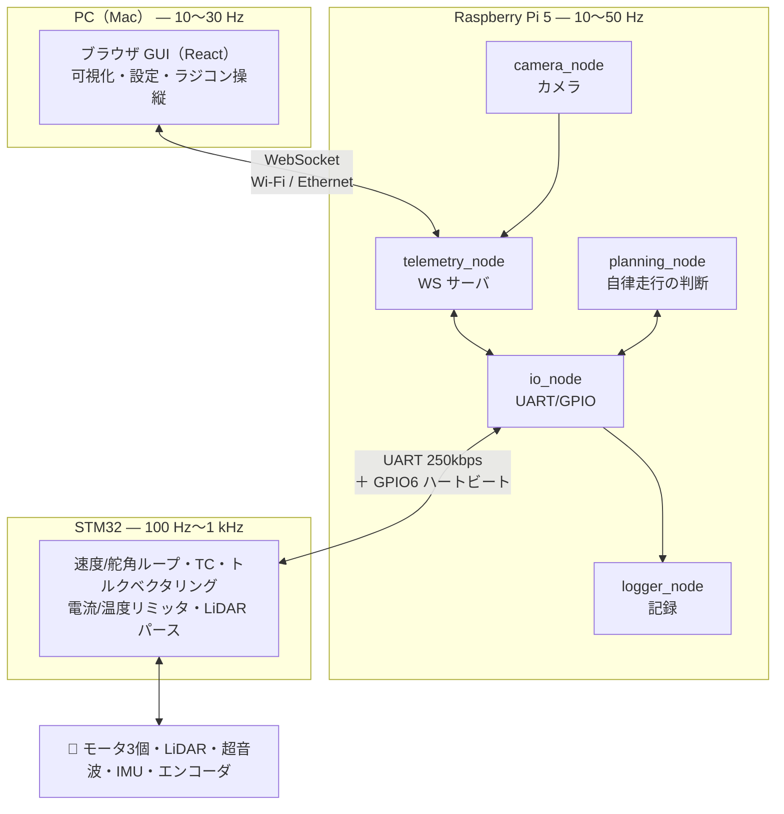
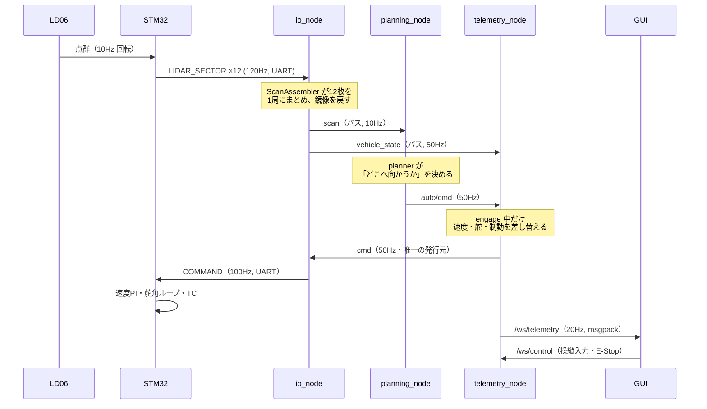
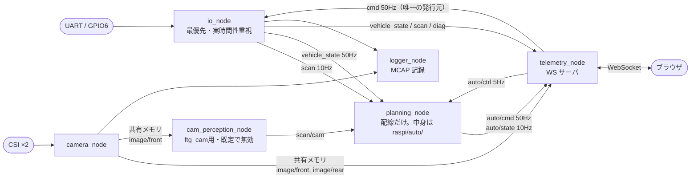
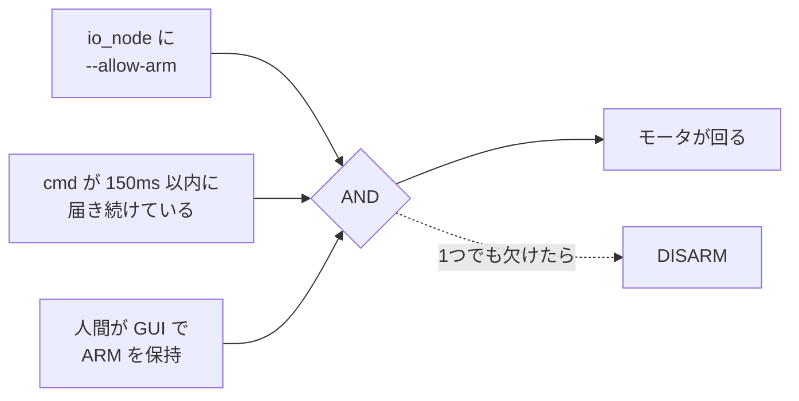

# SURGE Mark.2 システム全体像

**対象**: このシステムを初めて見る人／久しぶりに戻ってきた人
**最終更新**: 2026-08-28

自律走行ミニカー **SURGE Mark.2** が、**何を・どこで・どういう順番でやっているか**を
一通り追えるようにした文書。**「なぜそう設計したか」は [`architecture.md`](architecture.md)、
「今どこまで進んだか」は `PROGRESS.md`、「どう直して反映するか」は
[`development.md`](development.md)** を見ること。

---

## 目次

1. [1枚で見る全体像](#1-1枚で見る全体像)
2. [ハードウェア](#2-ハードウェア)
3. [3階層アーキテクチャ](#3-3階層アーキテクチャ)
4. [データが一周する流れ](#4-データが一周する流れ)
5. [3つの通信路](#5-3つの通信路)
6. [Raspberry Pi の中身 — プロセスとトピック](#6-raspberry-pi-の中身--プロセスとトピック)
7. [座標系と単位の約束](#7-座標系と単位の約束)
8. [安全設計 — 止まる仕組み](#8-安全設計--止まる仕組み)
9. [自動運転のしくみ](#9-自動運転のしくみ)
10. [GUI](#10-gui)
11. [記録と再生](#11-記録と再生)
12. [シミュレータ](#12-シミュレータ)
13. [現在地とロードマップ](#13-現在地とロードマップ)
14. [用語集](#14-用語集)

---

## 1. 1枚で見る全体像

**3台の計算機が、それぞれ違う速さで違う仕事をしている。**



### 一言でいうと

| 誰が | 何を | どのくらいの速さで |
|---|---|---|
| **STM32** | モータを実際に回す。転ばない・燃えないようにする | 100Hz〜1kHz（**ms オーダー**） |
| **Raspberry Pi 5** | センサを読んで「どこへ向かうか」を決める | 10〜50Hz |
| **PC** | 人間が見る・設定する・遠隔操縦する | 10〜30Hz |

**Pi から STM32 へ送る指令は3つだけ**（目標速度・加速度上限・目標舵角）。
PWM デューティやトルク配分は一切送らない。

---

## 2. ハードウェア

### STM32（制御ボード）に付いているもの

| センサ／アクチュエータ | 内容 | Pi 側の設計に効く制約 |
|---|---|---|
| **LiDAR LD06** | 10Hz 回転・最大約12m。専用 UART 230400bps | **裏向きに実装**されており、点群は鏡像。10Hz なので1周 100ms の間に車が動き、扇形に歪む |
| **超音波 ×2**（前・後） | HC-SR04 系。2cm〜約4m | **実質 20Hz が上限**。50Hz の TELEMETRY に対し同じ値が連続する |
| **駆動モータ ×2**（後輪左右独立） | BLDC + 自作 MD。**トルクモード** | TC・トルクベクタリングは STM32 内で完結 |
| **ステアリングモータ ×1** | BLDC + 自作 MD。**位置モード**（サーボではない） | モータ角 → 路面舵角の**リンク比は 0.5 で確定**（2026-08-20 実測）。路面舵角上限 ±30° |
| **車速センサ** | 前輪左右の**アナログ絶対角エンコーダ**（ADC 読み） | 分解能が粗く強いローパスが掛かる。**ここから加速度を微分してはいけない**。低速では使い物にならない |
| **IMU MPU6050**（6軸） | Mahony 相補フィルタ。**地磁気センサ無し** | **絶対方位が出ない**。yaw は積分ドリフトする。TELEMETRY は `yaw_rate` のみ |
| **温度センサ ×4** | MD後左 / MD後右 / MDステア / STM32 内蔵 | 据え切りを続けると**ステア MD が過熱**する |
| **電源 2系統** | 駆動系（過電流 5.0A）／シグナル系（同 3.0A）。8セル NiMH | **片方だけ落ちる**（駆動を切っても Pi と STM32 は生きている） |

### Raspberry Pi 5 に付いているもの

| ピン／接続 | 用途 |
|---|---|
| CSI ×2 | 前方 / 後方カメラ（`picamera2`） |
| **GPIO6** | STM32 と接続。**緊急停止ハートビート**（100Hz 矩形波） |
| GPIO14 / GPIO15 | UART TX / RX ← → STM32 |
| GPIO18 / GPIO19 / GPIO13 | ブザー / LED緑 / LED赤 |

> **Pi 5 は Pi 3/4 と違う。** `RPi.GPIO` は RP1 チップで動かないので `gpiozero` + `lgpio`、
> カメラは `picamera2`、UART は `/dev/serial0` を使う（デバイス名を直書きしない）。

---

## 3. 3階層アーキテクチャ

### 原則：「速い制御はエッジに、遅い判断は上位に」

```
┌──────────────────────────────────────────────┐
│ PC        人間が見る・触る            10〜30 Hz │
└───────────────────┬──────────────────────────┘
                    │ WebSocket（3チャンネル分離）
┌───────────────────┴──────────────────────────┐
│ Pi 5      認知・判断                  10〜50 Hz │
│           知覚 → 自己位置 → 経路 → 行動判断      │
└───────────────────┬──────────────────────────┘
                    │ UART 250kbps ＋ GPIO6 ハートビート
┌───────────────────┴──────────────────────────┐
│ STM32     リアルタイム制御         100 Hz〜1 kHz │
│           速度/舵角ループ・TC・保護              │
└──────────────────────────────────────────────┘
```

**なぜ分けるのか。** TC やスリップ制御は数 ms 以内に効かせる必要がある。
UART 往復 + Python の処理遅延（合計 30〜50ms）を挟むと成立しないので、STM32 内に閉じる。

**そして、上位が落ちても下位が自力で安全を確保できる。**

| 落ちたもの | 何が起きるか |
|---|---|
| PC（GUI） | Pi は自律走行を継続できる。ただしラジコン操縦は 150ms で DISARM |
| Pi | GPIO6 ハートビートが止まる → **STM32 が E-Stop をラッチ** |
| STM32 | Pi 側が TELEMETRY 途絶を検知して FAULT |

---

## 4. データが一周する流れ

**LiDAR が壁を見てから、モータが反応するまで。**



### 遅延の内訳（Phase 1 で実測する）

| 区間 | 目安 |
|---|---|
| UART 往復（`cmd_seq_echo` で実測） | **8〜12ms** |
| GUI ↔ telemetry_node | 0.5〜1.6ms |
| telemetry_node の周期（`auto/cmd` → `cmd` の差し替え） | 最悪 20ms |
| **ステアリング機構の応答遅れ** | **50〜200ms（未実測）** |

> **合計 150ms は、時速 10km/h なら 40cm 進んでから舵が効き始めるということ。**
> 「低速では動くのに速度を上げた瞬間に蛇行が発散する」典型的な失敗の原因になる。
> だから Phase 1 で**必ず実測する**（`architecture.md` §14）。

### ★ 指令の発行元は `cmd` 1本に絞ってある

`planning_node` と `telemetry_node` の両方が `cmd` に publish すると、
購読側からは区別できないまま交互に上書きし合い、**止める側が負けることがある**。

```
GUI ──cmd(mode, arm, 灯火…)──▶ telemetry_node ──cmd──▶ io_node
planning_node ──auto/cmd(速度・舵)──▶     ↑ ここで差し替える
```

これにより、自律走行中も人間の安全網（ARM 保持・150ms 途絶で DISARM・E-Stop）が
そのまま生きる。

---

## 5. 3つの通信路

**役割も方式も違う3本があり、混ぜていない。**

| | STM32 ⇄ Pi | Pi 内部（プロセス間） | Pi ⇄ PC |
|---|---|---|---|
| **方式** | UART 250kbps 8N1 | ZeroMQ PUB/SUB ＋ 共有メモリ | WebSocket |
| **形式** | 自作バイナリフレーム（SYNC+TYPE+SEQ+LEN+CRC16） | msgspec / msgpack | msgpack（バイナリ）と JSON |
| **監視** | GPIO6 ハートビート・SEQ 欠番・CRC | ハートビート `hb/<node>` | 往復遅延を GUI に常時表示 |
| **定義の場所** | **`raspi/proto/protocol.toml`（唯一の定義）** | `raspi/msgs/types.py` | 同左（GUI 側は `gui/src/types.ts` に手写し） |

### 5.1 UART フレーム（STM32 ⇄ Pi）

```
┌────────┬──────┬─────┬─────┬───────────┬────────┐
│ SYNC   │ TYPE │ SEQ │ LEN │  PAYLOAD  │ CRC16  │
│ AA 55  │  1B  │ 1B  │ 1B  │  0-255B   │  2B    │
└────────┴──────┴─────┴─────┴───────────┴────────┘
```

主なパケット（**仕様の正は [`uart_protocol.md`](uart_protocol.md)、数値の正は `protocol.toml`**）:

| TYPE | 名称 | 方向 | 頻度 | 中身 |
|---|---|---|---|---|
| `0x01` | `LIDAR_SECTOR` | STM32→Pi | 120Hz（12枚/周 × 10Hz） | 30点ぶんの距離 [mm] ＋ 取得時刻 |
| `0x02` | `TELEMETRY` | STM32→Pi | 50Hz | 速度・舵角・各輪周速・オドメトリ・IMU・電流・温度・電圧・超音波・MD状態 |
| `0x08` | `STATS` | STM32→Pi | 1Hz | 累積エラーカウンタ |
| `0x10` | `COMMAND` | Pi→STM32 | 100Hz | mode・flags・目標速度・目標舵角・レート制限・制動トルク・駆動トルク |
| `0x12`/`0x06` | `PING`/`PONG` | 双方向 | 5Hz | 時刻同期 |

**`COMMAND.flags` の8ビットが安全の要**:
`arm` / `brake` / `horn` / `light_mode`(2bit) / `passing` / `torque_mode` / `auto_stop`

> **ゼロ値は安全側に倒してある。** `brake_torque = 0` は「制動 0」ではなく
> **「未指定＝STM32 側の最大で制動」**。フィールドの埋め忘れでブレーキが効かなくなる方が危険なため。

### 5.2 内部バス（Pi 内部）

**ZeroMQ を土台にし、メッセージ規約だけ自作。** 購読者の要求が違うので、
**3つの配送パターンを使い分ける**。

| パターン | 用途 | 実装 |
|---|---|---|
| **最新値のみ** | 制御指令・車両状態 | ZMQ PUB/SUB + `CONFLATE=1` |
| **取りこぼし厳禁** | ロガー・記録 | ZMQ PUB/SUB + `HWM` 大きめ |
| **大容量ゼロコピー** | カメラ画像 | `shared_memory` のリングバッファ |

**なぜ CONFLATE が要るか**: 購読側の処理が追いつかないとキューに溜まり、
**制御ノードが2秒前の点群で舵を切る**。しかも見た目は正常に動くので気づきにくい。

**なぜ画像を ZMQ に流さないか**: 640×480×3 を 30Hz で送ると **27MB/s** のメモリコピーが発生する。
共有メモリに置き、ZMQ には `{buf_id, w, h, format, t_capture}` の 60バイトだけ流す。

> **ZeroMQ の落とし穴2つ**（どちらも `test_zbus.py` で固定済み）
> 1. **`CONFLATE` は multipart 非対応。** `[topic, payload]` の2フレームで送ると黙って壊れる
>    → `topic + b"\0" + msgpack` の1フレームにした
> 2. **`CONFLATE` はソケット単位でトピック単位ではない。** 1本の SUB に相乗りさせると
>    **LiDAR が来るたびに車両状態が捨てられる** → トピック1本につきソケット1本

### 5.3 WebSocket（Pi ⇄ PC）

**1本にまとめない。** カメラのフレームが詰まった瞬間にラジコン入力まで遅延するため。

| チャンネル | 内容 | 方式 | 頻度 |
|---|---|---|---|
| `/ws/telemetry` | 車両状態・点群・リンク統計・自動運転の判断 | **バイナリ**（msgpack） | 20Hz |
| `/ws/camera/{front,rear}` | JPEG フレーム | バイナリ | 最大 15Hz |
| `/ws/control` | ラジコン入力・設定変更・状態通知 | JSON | イベント駆動 |
| `/ws/map` | 占有格子（3値を2bitに詰めて zlib 圧縮） | バイナリ | **版が変わったときだけ** |
| `/ws/record` | MCAP のライブ中継 | バイナリ | 記録中のみ |

**GUI 本体（`gui/dist`）も telemetry_node が HTTP で配る**（ポート 8000）ので、
WS と同一オリジンになり**接続先をコードに書く場所が存在しない**
（`gui/src/ws/url.ts` が `location.host` から組み立てる）。
`GET /logs/<name>` でログのダウンロードもできる。

---

## 6. Raspberry Pi の中身 — プロセスとトピック

**Python の GIL があるので、スレッドではなくプロセスで分ける。**



### systemd サービス（Pi 起動時に自動で上がる）

| unit | モジュール | 役割 | 止めると |
|---|---|---|---|
| `surge-io` | `raspi.nodes.io_node` | UART送受信・GPIO・時刻同期・`.sfl` 記録 | **★ E-Stop がラッチする** |
| `surge-camera` | `raspi.nodes.camera_node` | picamera2 → 共有メモリ | カメラが止まるだけ |
| `surge-telemetry` | `raspi.nodes.telemetry_node` | WS サーバ・GUI 配信 | GUI が繋がらない |
| `surge-planning` | `raspi.nodes.planning_node` | 自動運転の判断 | 自律走行だけ止まる |
| `surge-logger` | `raspi.nodes.logger_node` | MCAP 記録（**既定では無効**） | — |
| `surge-cam-perception` | `raspi.nodes.cam_perception_node` | カメラの走行可否セグメンテーション推論（`ftg_cam` 用）（**既定では無効**） | `ftg_cam` が使えなくなるだけ |
| `surge-logclean.timer` | — | 毎時、古いログを消す（7日超／合計8GB超） | ディスクが埋まる |

> **`surge-cam-perception` は他の4ノードと違い既定で無効。** `cam_perception_node` は
> `planning_node` の選択とは無関係にカメラフレームが来るたびCNN推論を回し続ける
> 独立プロセスなので、常時有効化すると `ftg_cam` を使う気が無くてもCPU・電力を
> 消費し続ける。有効化の手順は
> [`development.md` §12.2](development.md#122-カメラセグメンテーション走行ftg_cam)。

**`surge-planning` は常時上げてよい。** `auto/cmd` に出すだけで `cmd` には publish しないので、
起動していること自体が車を動かす条件にはならない。

### 主要トピック

| トピック | 中身 | 頻度 | 発行元 | 配送 |
|---|---|---|---|---|
| `vehicle_state` | 速度・各輪周速・路面舵角・オドメトリ・IMU・温度・電源2系統・フラグ | 50Hz | io_node | LATEST |
| `scan` | LiDAR 1周分の点群（360点＋セクタごとの時刻・受信有無） | 10Hz | io_node | LATEST |
| `scan/cam` | カメラの走行可否セグメンテーションを`scan`と同じ形に変換した擬似点群（`ftg_cam`専用） | 実測待ち | cam_perception_node | LATEST |
| `cam/model` | GUIが選んだセグメンテーションモデル名（`models/<name>.onnx`） | 1Hz | telemetry_node | LATEST |
| `e2e/model` | GUIが選んだE2E LiDARモデル名（`models/e2e_lidar/<name>.onnx`） | 1Hz | telemetry_node | LATEST |
| `diag/link` | リンク統計（loss / CRC / 往復 / 時刻同期 / **SIM バッジ**） | 10Hz | io_node | LATEST |
| `image/front`, `image/rear` | 共有メモリ参照（60バイト） | 最大 30Hz | camera_node | LATEST |
| `cmd` | 目標速度・舵角・フラグ | 50Hz | **telemetry_node（唯一）** | LATEST |
| `auto/ctrl` | どのモードで走るかの意思・パラメータ | 5Hz | telemetry_node | LATEST |
| `log/ctrl` | `.sfl` 記録の開始/停止の意思 | 1Hz | telemetry_node | LATEST |
| `auto/cmd` | 自律走行の目標速度・舵角 | 50Hz | planning_node | LATEST |
| `auto/state` | その判断の根拠（選んだギャップ・自己位置・段） | 10Hz | planning_node | LATEST |
| `auto/map` | 占有格子 | 版が変わったとき | planning_node | LATEST |
| `hb/<node>` | ハートビート | 10Hz | io / control / planning | LATEST |

**全メッセージが `t_capture` / `t_pub` / `seq` の3フィールドを必ず持つ。**
これが無いと、後でセンサ融合を作るときに全メッセージ定義を書き直すことになる。

**バスのエンドポイントは「ノード単位」**（トピック単位ではない）。
既定は `ipc:///tmp/surge-bus/<node>.ipc`（`SURGE_BUS_DIR` で移動、`SURGE_BUS_TCP` で TCP に切替）。
**購読はトピック1本につき SUB ソケット1本**にしている（理由は §5.2 の落とし穴2つ）。

> ### ★ 設計書にあって実装に無いもの
>
> `architecture.md` §6.1 の図には **`perception_node`** と **`safety_node`** があるが、
> **どちらも実装されていない**。知覚は planner が直接 `scan` を見ており、
> Watchdog（`hb/*` を 300ms 監視して FAULT にする役）は**存在しない**。
> 現状その役目は **GPIO6 ハートビート（第1層）が代替している** — io_node のループが
> 止まれば波形も止まり、STM32 側が E-Stop をラッチするため。
> 同様に `grid/local` / `pose` / `path` トピックも未実装で、
> 相当する情報は `auto/state` と `auto/map` に入っている。

---

## 7. 座標系と単位の約束

**ROS の慣例（REP-103 / REP-105）に従う。** 自作フレームワークであっても、である。
理由は ①論文・教科書の式がそのまま使える ②将来 ROS 2 に移る場合の摩擦がゼロ
③独自ルールは3ヶ月後に思い出せない。

| 項目 | 規約 |
|---|---|
| 座標系 | **右手系。x = 前、y = 左、z = 上** |
| 角度 | **反時計回りが正**（左旋回が正） |
| 単位 | **SI 固定**（m, m/s, m/s², rad, rad/s, s） |
| 時刻 | ns 単位の整数、Pi の `CLOCK_MONOTONIC` 基準 |

**内部は絶対に SI。km/h や度への変換は GUI の表示直前（`gui/src/format.ts`）でだけ行う。**

### フレーム階層

```
map ──── odom ──── base_link ──┬── lidar
 │        │            │        ├── cam_front
 │        │            │        └── cam_rear
 │        │            └─ 後輪車軸の中心に置く
 │        └─ 連続で滑らか。ただしドリフトする → 局所制御はこちら
 └─ SLAM が補正する。跳ぶことがある → 大域経路計画はこちら
```

- **`odom` と `map` を分ける理由**: SLAM のループクロージャが効いた瞬間、自己位置は
  数十 cm「跳ぶ」。これを制御ループに直接食わせると舵が暴れる
- **`base_link` を後輪車軸中心に置く理由**: アッカーマン車両の運動学（自転車モデル）が
  最も簡潔になる。Pure Pursuit の標準式も後輪基準

$$\dot{x} = v\cos\theta,\quad \dot{y} = v\sin\theta,\quad \dot{\theta} = \frac{v}{L}\tan\delta$$

### 車両パラメータは `config/vehicle.toml` に集約

**全ノードがそこだけを見る。** 同じ数字を2箇所に書くと必ず片方が古くなる。

> ⚠ **`measured = false`。** `[dynamics]`（アクチュエータの動特性）が**未実測の暫定値**。
> 幾何（ホイールベース・トレッド・リンク比・車輪半径・外形・センサ取付。後輪は
> ダイレクトドライブでギア比の概念が無い）と質量は 2026-08-20 実測確定済みで、
> リンク比・車輪半径は STM32 ファームウェアの換算定数にも反映済み（`architecture.md` §15）。
> **Phase 4 の経路追従までには `[dynamics]` の実測が必要。**

---

## 8. 安全設計 — 止まる仕組み

**自律走行で最初に作るべきは走る機能ではなく止まる機能。** 互いに独立した3層にする。

```
[1] ハードウェア層   GPIO6 ハートビート、STM32 内の電流・温度リミッタ
[2] STM32 ファーム層 UART 受信タイムアウト(100ms)で自動ブレーキ
[3] RasPi ソフト層   cmd 途絶検知、障害物近接での減速、Watchdog
```

### 8.1 GPIO6 ハートビート（第1層）

**単純なアクティブ Low の E-Stop はフェイルセーフにならない。**
断線するとプルアップで High（＝正常）に戻ってしまい、異常を検知できないため。

```
Pi   : GPIO6 に 100Hz の矩形波を出し続ける
STM32: エッジを監視し、50ms 途切れたら即ブレーキ + estop_active（ラッチ）
```

この1本で、**Pi のフリーズ・電源断・断線・プロセスのクラッシュ**をすべて検出できる。
実測は 100.0Hz・最大遅れ 0.46ms、途絶からラッチまで 64ms。

> **★ 復帰は必ず人間の明示操作を経由する。** ラッチの解除は**車両のボタン2**を物理的に押すこと。
> 自動復帰させない（原因未解消のまま走り出すため）。
> つまり **`surge-io` を止める＝車が現地に行くまで動かなくなる**。

### 8.2 タイムアウトの一覧

| 何が | どれだけ途絶したら | どうなる |
|---|---|---|
| GPIO6 ハートビート | 50ms | **STM32 が E-Stop をラッチ** |
| `COMMAND`（Pi→STM32） | 100ms | STM32 が自動ブレーキ |
| `TELEMETRY`（STM32→Pi） | 100ms / 200ms | DEGRADED（警告のみ）／ FAULT |
| `cmd`（バス上） | 150ms | io_node が DISARM を送る |
| `auto/cmd`（planner の死亡） | 200ms | telemetry_node が制動に読み替える |
| `scan` が古い | 300ms | planning_node が制動指令に読み替える |
| GUI の無操作 | 20秒 | DISARM（**ただし自律走行中は掛けない**。人が触らないのが正常なため） |

**上りと下りで非対称にしてある**のは、単発の CRC エラーや一時的なロスで即 FAULT に
落とさないため。50Hz なら 100ms ＝ 5発で、ノイズ環境なら 5発連続ロスは起こりうる。

### 8.3 モータが回る条件は3つ



**デッドマンは「離したら `speed=0` を送る」ではなく「送信そのものを止める」。**
0 を送る設計だと、その指令が届かない状況（＝一番止めたい状況）で止まらない。
ブラウザのフリーズ・タブの離脱・Wi-Fi 断がすべて同じ経路で停止になる。

**engage ≠ ARM。** 自律走行の engage は「自律に任せてよい」という意思表示にすぎず、
planning_node は `arm` を立てられない。engage の状態は保存されないので、
**電源を入れただけで走り出す経路が存在しない。**

### 8.4 駆動電源ラッチは異常ではない

過電流で `DRIVE_POWER` がハード遮断されると**ラッチし、電源をリセットするまで復帰しない**。
このとき STM32 は `drive_power_locked` を立て、Pi が `arm` を要求しても `armed` を立てない。

**通信 FAULT と区別して**「駆動電源ラッチ中 — 電源を入れ直してください」と GUI に出す。

### 8.5 ビヘイビア状態機械（設計。実装は一部）

```
    [INIT] → [IDLE] ⇄ [MANUAL]
                │
                ▼
             [AUTO] ─┬─ MAPPING / CRUISE / AVOID
                     └─ PARK_SEARCH / PARK_EXEC

    どの状態からでも ──→ [FAULT] / [ESTOP]（復帰は IDLE 経由のみ）
```

**現在状態と、直前の遷移理由を必ず GUI に出す。**
「なぜ止まったか」が分からないのがデバッグを最も消耗させる。

---

## 9. 自動運転のしくみ

### 9.1 「純粋な計算」と「配線」を分けてある

| ファイル | 役割 |
|---|---|
| `raspi/auto/base.py` | `Planner` と `ParamSpec`。**バスも WS も知らない純粋な計算** |
| `raspi/auto/<algo>.py` | アルゴリズム本体 |
| `raspi/auto/registry.py` | id → クラス。GUI へ渡す宣言（`catalog()`）もここ |
| `raspi/nav/` | SLAM・占有格子・経路生成（`raceline` だけが使う） |
| `raspi/nodes/planning_node.py` | 配線だけ（購読・周期・publish） |

**モードを足しても GUI を触らない。** `registry.py` に1行足せば GUI の選択肢に出て、
パラメータのスライダも planner が宣言した `ParamSpec` から自動生成される。
**GUI にモード名を書くと、増やすたびに2箇所直すことになり、いつか片方が古くなる。**

`Planner` が守る**4つの約束**:

1. `plan()` は状態を持ってよいが、`reset()` で完全に初期化できること
2. 戻り値は `AutoState`。指令（速度・舵・制動）と**理由 `reason` を必ず同時に返す**
3. 走ってよいか分からないときは `ready=False`。planning_node が制動に読み替える
4. パラメータは `params` に宣言する（GUI が自動生成する）

### 9.2 実装されているモードは5つ

| id | 名前 | 地図 | 考え方 |
|---|---|---|---|
| `ftg` | **Follow the Gap** | 不要 | 点群の中で**最も広く空いた区間**を選び、**その真ん中**を狙う |
| `ftg_cam` | **Follow the Gap（カメラ）** | 不要 | `ftg`と全く同じロジックを、カメラの走行可否セグメンテーションから作った擬似点群で走らせる |
| `de` | **Disparity Extender** | 不要 | 物の縁を車体半幅ぶん**塗り潰してから**、一番遠い帯の真ん中を狙う |
| `raceline` | **レーシングライン** | **必要** | SLAM で地図を作り、最小曲率の経路を引いて Pure Pursuit で追う |
| `e2e_lidar` | **E2E LiDAR** | 不要 | 強化学習（PPO）で点群→ステア/速度を**直接回帰**する方策。ギャップ探索のようなアルゴリズムそのものを持たない |

#### `ftg` — 最遠点ではなく「区間の真ん中」を狙う

最遠点狙いにすると**壁際すれすれを縫う挙動**になり、車幅ぶんの余裕が無いミニカーでは
外輪が壁に当たる。処理は6段: 前方 ±fov/2 を切り出す → 最小値フィルタ →
最近傍点の周りを「安全バブル」で侵入禁止に塗る → `gap_min` 以上が続く最長区間を選ぶ →
真ん中を狙う → 正面余裕と舵角の大きさで速度を落とす。

#### `de` — FTG の上位互換（**現在の本線**）

隣り合う測定値が `disparity_m` 以上飛んでいる所を「物の縁」とみなし、その**遠い側**を
近い側の値で塗る。塗る角度幅は `atan2(safety_half_width, r)` ＝ 距離 r の所で車体半幅を
見込む角度で、**近いほど広く塗る**。塗った後は「一番遠い帯の真ん中」を狙う。

**シムでの実測（180秒周回・すべて衝突 0）**:

| コース | FTG | **DE** |
|---|---|---|
| circuit | 37.2s | **16.9s** |
| oval | 36.5s | **15.8s** |
| split（分離帯あり） | **1周もできず** | **40.5s** |

★ **速度は「狙う方向の見通し」で決め、正面の扇で測り直さない。**
道幅 1.0m の走路では中央に居ても壁が 0.5m 横にあるので、正面 ±20° の扇の最小値を採ると
**どんな直線でも見通しが 1.5m を超えない**。これが FTG が踏み切れない理由で、
直しただけで circuit のラップが **62s → 17s** になった。

#### `ftg_cam` — カメラでLiDARが見えない低い壁を補う

`ftg`の`plan()`は一切上書きしない。ギャップ探索・安全バブル・速度決定はセンサを
問わないロジックだと示すための狙った制約で、新しいのは`cam_perception_node.py`
（前方カメラの走行可否セグメンテーションを`raspi.nav.ipm`で地面座標へ逆投影し、
既存の`OccGrid.raycast()`で`scan`と同じ形の距離配列に変換して`scan/cam`へ流す）
だけ。**独立プロセス**（`planning_node`の中ではない）で、カメラの実視野
（hfov≈66°）を超えて`fov_deg`を広げても意味が無いので60°に絞ってある。

#### `e2e_lidar` — 学習ベースで地図も経路も持たない

`ml_lidar/train_rl.py`（Stable-Baselines3のPPO、シム上の強化学習）で学習した方策を
ONNX化し、点群をそのままステア／速度へ回帰する。`de`のような**教師データを使う
模倣ではない**——「コースに沿って進めたら＋報酬・衝突したら－報酬」を頼りに試行錯誤
で最適化したもので、`de`を再現するのではなく**それを超えうる**代わりに、未知の
点群パターンに対する挙動は原理的に保証できない。そのため`stop_dist`（正面の余裕が
閾値を切ったらモデル出力を無視して無条件停止）という独立した安全策を必ず持つ——
`de`の`stop_dist`と同じ「測距不能を空き扱いにしている穴を受ける最後の砦」という
理由。学習・ONNX化・GUIでの使い方は[`development.md` §12](development.md#12-学習ベースの自動運転を動かすlidar-e2e--カメラセグメンテーション)。

#### `raceline` — 3つの段を持つ状態機械

```
[EXPLORE] ──2周──▶ [BUILD] ──▶ [RACE]
 地図を育てる       地図凍結→中心線     凍結地図で自己位置だけ
 （中身は FTG）     →経路→速度計画      推定し、Pure Pursuit で追う
                    ★その場で停止      ★遷移は不可逆
```

- **EXPLORE を2周にしてある**のは、1周では**動く物が地図から消えない**ため
  （痕跡が消えるには「その場所を別の時刻にもう一度見る」必要がある）
- **BUILD 中は止まるのが正しい。** 計算は**2周期に分けてある** —
  `plan()` が1回で 100ms 掛かると `auto/cmd` が途絶し、200ms 判定で制動に落ちるため
- 経路は**最小曲率最適化**（中心線からの横ずれ α を変数にした二次計画）。
  アウトインアウトを「そう走れ」と教えているのではなく、**曲率の総量を最小にすると
  結果としてそうなる**
- 速度は「横 G の上限 → 後ろ向きパス（減速）→ 前向きパス（加速）」の3段。
  **減速を先に掛ける**（「止まれない速度で入る」方が「加速が足りない」より危険）

### 9.3 「走る」より「止まる」を先に決める

**`ready=False`（計画を放棄）と `brake=True`（意図した停止）を区別している。**

| 誰が | 条件 | 挙動 |
|---|---|---|
| planner | セクタ受信率が視野の 60% 未満 | `ready=False` → 制動 |
| planner | 正面の余裕が `stop_dist` 未満 | `ready=True` + `brake`（**舵は保持**。曲がりながら止まれる） |
| planner | 通れる隙間が1つも無い | `ready=False` |
| `raceline` | 自己位置の一致度が `min_score` 未満 | `ready=False`「自己位置が信用できない」 |
| `raceline` | 経路からの横偏差が `max_cross` 超 | `ready=False`「経路から Ncm 離れた」 |
| planning_node | 点群が **300ms** 古い | 制動指令に読み替える |
| planning_node | モード未選択・点群未着 | `ready=False` |
| telemetry_node | `auto/cmd` が **200ms** 途絶（planner の死亡） | 制動に読み替える |
| GUI | 人が舵・スロットル・ブレーキを触った | 自律を解除して手動に戻す（クルコンと同じ作法） |
| GUI | E-Stop / 操縦権の解放 / 接続断 | engage も同時に落ちる |

**「正面が詰まっている」を「隙間が無い」より先に判定する。**
どちらも止まるが、人が読んで原因が分かるのは「正面 20cm」の方だから。

> ⚠ **`sector_seen == False` は「障害物なし」ではない。** 欠測した方向は距離 0（侵入禁止）
> として扱う。空きとして扱うと、**LiDAR が片側だけ落ちた瞬間にその方向へ舵を切る。**
>
> 一方 **`dist == 0`（測距不能）だけは空きとして扱っている** — これが唯一、危険側に
> 倒している判断で、「開けた場所で一歩も動けなくなるくらいなら、正面の停止距離と
> 超音波の `auto_stop`（20cm）で受ける」という取引の上に成り立っている。
> **地図に焼くときは逆に捨てる**（一度「空き」と書いた場所は後から直せないため）。

### 9.4 SLAM で踏んだ落とし穴（`raspi/nav/`）

SLAM は棚上げ中だが、**実測で分かったことは資産**なので要点だけ残す。

| 踏んだこと | 何が起きたか | 直し方 |
|---|---|---|
| 姿勢の基準時刻を「今」にした | 点群の時刻より 15〜20ms 進んだ姿勢で照合するので、毎周期その分**後ろへ引き戻される**。**誤差のほぼ全部がこれだった** | 姿勢は常に**点群の終端時刻**のものとして持つ |
| 未探査領域の点を「外れ」と数えた | 前へ進むほど前方の点が 0 点になるので、**後ろへずれた方が得点が上がる**（70秒で −0.38m） | 未探査に落ちる点は**照合から外す**。判定は初期姿勢で1回だけ（分母を固定しないと比較にならない） |
| レイ終端まで空きを彫った | **自分のレイが壁を彫り消す**。特にコーナー内側（3440セルが壁から外れた） | 終端の手前 1.5 セルを彫らない |
| 得点の最大値を素直に採った | 平行な壁の区間（corridor problem）で毎周期でたらめに滑る（**60秒で 2.8m**） | オドメトリ事前分布による**罰則**を足す |
| 得点を最近傍で引いた | 5cm 刻みの階段になり、細かい探索が無意味に。**1周で 12° ずれた** | 双線形補間 |
| ループ閉じで「始点にぴったり戻った」と仮定 | 周回判定は 0.8m の許容があるので、**その誤差を自分で注入する**（正確さ 99% → 71%） | 残差は必ず**点群と地図の照合**で測る |
| 車輪オドメトリを使った | 前輪が操舵輪・諸元未実測・低速でばたつく | **回頭はジャイロ、前進は `speed`。車輪の値は使わない** |

### 9.5 現在の方針 — SLAM は一旦棚上げ（2026-08-14）

自作 LiDAR SLAM は circuit コースで自己位置 2.6cm まで到達したが、
**oval コースでループが閉じない**・**RACE 段が開始直後に壁へ接触して固着する**が未解決。
一方で反射型の **`DisparityExtender` がシムで 2.2倍速く**、SLAM が1周もできなかった
分離帯コース（split）も周回できた。

**当面は反射型を本線にする。** `raspi/nav/`（SLAM 一式）は**消さない**。
「一旦」であって撤退ではない。

| SLAM があって初めてできること | 非SLAM での代替 |
|---|---|
| レーシングライン（アウトインアウト） | **無い。** 反射型は毎周期その場で決めるだけ |
| 先読みブレーキ（次のコーナーの形） | 見通しで近似。**原理的に劣る** |
| ラップ計測・周回数 | ジャイロの累積回頭 ÷ 360° で数えられる（地図不要） |
| 「経路から落ちた」の検出 | 無い。`stop_dist` と超音波 `auto_stop` が最後の砦 |

---

## 10. GUI

### 10.1 情報を「見る頻度」で4層に分ける

**「何を表示するか」から入ると破綻する。** 表示したい項目は20個以上あり、
全部を同じ大きさで並べると何ひとつ読めない画面になる。
項目の重要度ではなく、**人間がどれくらいの頻度でそこに視線を置くか**で分ける。

| 層 | 性質 | 扱い | 該当項目 |
|---|---|---|---|
| **A. 常時凝視** | 走行中ずっと見ている | 画面の大部分 | 前方カメラ、LiDAR 俯瞰、予定進路 |
| **B. 常時周辺視** | 横目で追う | 小さく固定配置、色で異常を伝える | 速度、舵角、モード、遅延 |
| **C. 異常時のみ** | 普段は見ない | **平常時は畳み、閾値超えで自動的に前に出す** | 温度4点、電圧、CPU、パケットロス |
| **D. 診断・設定** | 走行後・調整時 | **別タブに隔離** | パラメータ、グラフ、キャリブレーション |

**C の扱いが設計の肝。** 温度や電圧を常時大きく出しても、正常な間は情報量がゼロ。

> **累積カウンタを「異常時のみ開く」パネルの自動展開条件にしてはいけない。**
> CRC エラーが起動直後に1回出ただけでパネルが開きっぱなしになり、層 C を畳んだ意味が消える。
> **「今まさに異常」だけを自動展開の条件にし、累積はバッジで数字だけ出す。**

### 10.2 タブは5枚

| タブ | 誰のための画面か | 特徴 |
|---|---|---|
| **ラジコン**（既定） | 運転する人 | 速度計・G メータ。介入は数値ではなくランプ。設定は ⚙ ドロワー |
| **自動運転** | 開発する人 | 前方・後方・LiDAR を**対等に3分割**。指令と実測を並べ、遅れをそのまま読む。モード選択と engage |
| **地図生成** | 地図を見る人 | 世界座標のものを全部ここに集める（占有格子・中心線・レーシングライン・軌跡・自車） |
| **診断** | 原因を追う人 | 現在値の全項目 ＋ 時系列グラフ（uPlot・直近180秒・10Hz で常時記録） |
| **ログ** | 後で見る人 | `.sfl` 記録の開始/停止、mcap ライブ中継、ファイル一覧・DL・削除 |

**同じデータを2つの運転画面が見ている。** 違うのは選び方の基準で、
ラジコンは「周辺視で読めるか」、自動運転は「原因を切り分けられるか」。

**モード選択と engage は「自動運転」タブ1箇所だけ。** 地図生成タブに置いてあるのは
「地図を確定」と「地図を削除」だけで、走らせる操作は重複させていない。

**診断グラフは走行中ずっと裏で記録している**（タブを開いているかに関係なく）。
異常に気づいてから開いても手遅れなため。切断時はバッファを消さず、
全系列 NaN の点を1つ積んで**線をそこで断つ**（切れたこと自体が後から見たい事象）。

### 10.3 20〜30Hz のデータを React の state に入れない

入れると再レンダリングで即座に破綻する。**流量で3つに分ける。**

```
WebSocket ─┬─▶ 点群・カメラ  → bus/live.ts に置き、Canvas が rAF で読む（React を経由しない）
           ├─▶ 数値表示      → 8Hz に間引いて配る（人間は 20Hz の数字を読めない）
           └─▶ 接続状態・設定 → イベント時のみ zustand
```

| 用途 | 採用 | 却下した理由 |
|---|---|---|
| 状態管理 | **Zustand** | Redux はこの規模には過剰 |
| 時系列グラフ | **uPlot** | Chart.js / Recharts はリアルタイム更新だと重い |
| 点群・占有格子 | **Canvas 2D** | 360点なら十分 |

### 10.4 操縦

| 操作 | キーボード | ゲームパッド |
|---|---|---|
| **ARM（入・切のトグル）** | **`Enter`** | （割当なし。画面のボタンか `Enter`） |
| **E-STOP ＋ 即 DISARM** | **`Esc`** | **B / ○** |
| 前進 / 後退 | `W`,`↑` / `S`,`↓` | R2 / L2（アナログ） |
| 舵 左 / 右 | `A`,`←` / `D`,`→` | 左スティック X |
| **BOOST**（`maxSpeed` そのもの） | `Shift` | R1 |
| ブレーキ | **`Space`** | L1 |
| クラクション（押している間ずっと） | `H` | A / × |
| パッシング | `P` | X / □ |
| 灯火モードを1つ進める | `L` | Y / △ |

> ⚠ **`Space` はデッドマンではなくブレーキ。** 以前は「Space を押している間だけ送る」
> デッドマン方式だったが、**押しながら WASD を操作するのが難しい**ため
> **`Enter` の ARM トグル ＋ 無操作タイムアウト**に変更した。
> `gui/README.md` の操作表はこの変更前のまま（要修正）。

**ARM 方式にしたことで失ったもの**: 「手を離した瞬間に止まる」性質。
無操作でも既定 20秒は armed のまま（速度指令は 0 に落ちるがモータは励磁される）。
**代わりに残してある即時停止経路**は全部生きている:

| 経路 | 応答 |
|---|---|
| `Esc` / 画面の E-STOP / パッド B | 即 DISARM（**権限も条件も要らない**） |
| ウィンドウのフォーカス喪失 | 即 DISARM |
| タブが背後に回る | 即 DISARM |
| ブラウザのフリーズ・Wi-Fi 断 | 送信が止まる → サーバ 150ms → io_node 150ms で DISARM |

**「なぜ止まったか」は必ず画面に出す**（`ui.disarmReason`）。
「Esc で E-STOP」「タブが背後に回った」「20秒 無操作で自動解除」など。

**操縦権は同時に1人。** 2枚目のタブが握ると拒否される
（2画面から舵を切ると「なぜか勝手にハンドルが戻る」という再現困難な症状になる）。
判定はクライアントが自分で生成した ID の文字列一致で行う。
**E-Stop だけは権限を問わず誰でも押せる。**

**灯火・ホーン・パッシングは ARM していなくても効く。**
ただし**出すものが無いときは送らない** — 送り続けると操縦権を握りっぱなしになる。

**自律走行中も、指令を 50Hz で送り続けているのは GUI**（速度・舵は 0 でサーバが差し替える）。
つまり上の停止手段がそのまま自律走行の停止手段になる。
手動との違いは2点だけ:
**①人が舵・スロットル・ブレーキを触ったら自律を解除**（クルコンと同じ作法）、
**②無操作タイムアウトを掛けない**（人が触らないのが正常な状態のため）。

### 10.5 設定は Pi 側が single source of truth

- GUI 起動時に全設定を取得して表示
- 変更は個別に SET → `CONFIG_ACK` の `applied` で確定
- **楽観的更新をしない**。範囲外の値はクランプされるので、
  GUI が「12.0 m/s に設定した」と表示しているのに実機は 8.0 m/s、という食い違いが起きる

---

## 11. 記録と再生

**開発効率を最も大きく左右する部分。** 旧シミュレータを削除した今、
**「実データの記録・再生」が事実上のシミュレータ代わり**になる。

### 2種類あり、目的が違う

| | `.sfl` | `.mcap` |
|---|---|---|
| 書く人 | `io_node`（実時間ループの中） | `logger_node`（別プロセス） |
| 中身 | **UART の生バイト**（送受信とも） | 解釈済みトピック **＋ カメラ画像** |
| 依存 | **stdlib のみ** | `mcap` |
| 置き場 | **Pi の SD**（Wi-Fi が切れても止まらない） | **PC**（SD には1バイトも書かない） |
| 量 | 2.5MB/分 | 10.3MB/分（大半が画像） |
| 尻切れ | **前半は必ず読める** | 索引が要る → `mcap_repair` で救う |

> **なぜ `.mcap` を SD に書かないか。** 実測 10.3MB/分は **1日 15GB** に相当し、
> 28GB の SD を毎日半分書き潰す。**SD は書き換え回数に寿命がある。**
> `logger_node -o -` で標準出力に流し、WebSocket か ssh パイプで PC に落とす。
> SD への書き込みは実測 **10.54 → 2.42 MB/分（77%減）**になった。

### 再生

```bash
python -m raspi.nodes.replay_node logs/run.sfl --bus --loop
```

**`io_node` の代わりにバスへ流し込む**ので、その上流（perception / planning / GUI）は
実機と同じコードのまま動く。**バグ再現が確定的にできる**（「あの時だけ壁に突っ込んだ」を再現できる）。

`.sfl` → `.mcap` の変換も `replay_node` + `BusBridge` をそのまま通すので、
**実機・再生・変換の3つで同じ解釈コードが動く**（書き直すと必ずズレる）。

`.mcap` は **Foxglove Studio でそのまま開ける**（自作 GUI＝ライブ用、Foxglove＝オフライン解析用）。

---

## 12. シミュレータ

**実車が無い場所（Mac）で、実機と同じ制御コードのまま走らせる仕組み。**

### 入れ替え点は `SerialLink` の位置

```
                            ┌─── SerialLink ──→ 実 STM32
io_node ── link.poll/send ──┤
                            └─── SimLink ────→ 仮想STM32 + 車両モデル + 仮想LD06 + コース
```

`import serial` はリポジトリ全体で `raspi/io/serial_link.py` の**1箇所だけ**。
ここに同じ約束を満たす偽物を差すと、**`io_node` より上流は1行も変わらない**。

**実機と同一のコードが走るもの**: パケット定義・CRC・フレーミング・`convert.py` の換算と
クランプ・`ScanAssembler` の鏡像反転・時刻同期・`--allow-arm` ゲート・`cmd` 150ms
タイムアウト・`bus_bridge`・`telemetry_node`・GUI。

### モデル化の深さ

| 入れてある | 入れていない |
|---|---|
| 自転車モデル（後輪車軸中心） | タイヤモデル・スリップ・横滑り |
| 操舵の**むだ時間 + 1次遅れ** + レート制限 | TC / TV の介入 |
| 速度の1次遅れ + `accel_limit` | カメラ画像の生成 |
| 車体外形（多角形）での衝突判定 | 路面μ・勾配 |
| **仮想 LD06**（距離ノイズ・点欠損・**セクタ欠損**・伝送遅延・走査ゆがみ） | 電流・温度・電圧の物理的根拠 |
| UART の線上時間（250kbps）による順番待ち | |
| 仮想 STM32 の独立した時計（既定 +3378ppm） | |

**物理が浅くセンサが作り込んである**のは意図的。アクチュエータの動特性（`[dynamics]`）は
未実測で**合わせ込む相手がまだ無い**一方、綺麗すぎる点群で開発すると**実車で初めて破綻する**ため。

### シムの概念を実機側に持ち込まない

**シミュレータが偽装するのは STM32 だけ。** コース切替・ノイズ量・欠損率は実機に対応物が
無い概念なので、その操作 UI は実機 GUI ではなく **`sim/gui.py`（pygame）側**に置く。
シム ↔ シム GUI の通信も、内部バスではなく **UDP ループバック**にしてある。

> **唯一の例外が SIM バッジ**（`LinkDiag.sim`、bool 1個）。これは利便性ではなく**安全要件**で、
> シムと実機の画面が見分けられないと
> 「**シムのつもりで `--allow-arm` した実車が動く**」が起きる。

### わざと鏡像で出している

実機の LD06 は裏向き実装で、`ScanAssembler` が `車両角 = (360 − センサ角) % 360` で戻している。
**シミュレータは反転した状態で `LIDAR_SECTOR` を出す。**
素直に車両座標で出すと、反転処理が壊れていても画面が正しく見えてしまい、
**バグを永久に検出できない。**

---

## 13. 現在地とロードマップ

### ロードマップ

| Phase | 内容 | 達成条件 | 状態 |
|---|---|---|---|
| **0** | UART プロトコル、GPIO、時刻同期、**ログ記録・再生**、WS サーバ、GUI 骨格 | PC からラジコン操縦できる／全データが記録できる | **✅ 完了** |
| **1** | 可視化の完成、設定反映、**カメラ校正**、**アクチュエータ遅延の実測** | 走らせながら状態が全部見える | 進行中 |
| **2** | 反射行動（緊急停止・壁沿い走行・障害物回避） | 地図なしで壁にぶつからず走り続ける | シムで先行実装 |
| **3** | 自己位置推定と環境地図 | コースを走り切るのに足る位置情報 | **一旦棚上げ** |
| **4** | 大域経路計画 + 経路追従（Pure Pursuit → MPC） | 地図上の目標点へ自律走行 | — |
| **5** | カメラ認識の本格活用、**駐車タスク** | 指定枠への自動駐車 | — |

**Phase 0 と 1 に時間をかけるほど、後が速くなる。**

### 実車で確認済みのもの

UART 疎通（往復 8.4ms・loss 0）／`.sfl` 記録と再生の完全一致／GPIO E-Stop の
端から端まで（途絶→ラッチ 64ms）／カメラ2台 30fps 同時／共有メモリのゼロコピー読み出し／
LED 表示8パターン／**キーボードでの実車走行**／systemd 自動起動（電源投入から20秒で復帰）／
MCAP 記録／プロトコル v0.5・v0.6・v0.7。

### 未解決・要相談

| 件 | 状態 |
|---|---|
| `steer_actual` が指令 0° で **−24.0°** に張り付く | 原点ずれの疑い。**Phase 1 の遅延実測の前に潰す** |
| GUI のカメラが前後とも 14fps | 未調査（camera_node 自体は 30fps） |
| STM32 の時刻が **+3378 ppm 速い** | STM32 側と要相談 |
| MD バスの CRC エラー率 **23〜25%**（3台とも） | STM32 側と要相談 |
| Pi が原因不明の再起動（2026-08-07 に2回） | 永続ジャーナル有効化済み。**再発したらログを見る** |

---

## 14. 用語集

| 用語 | 意味 |
|---|---|
| **ARM / DISARM** | モータへの通電を許可した状態／禁じた状態。ARM は人間が GUI で保持し続ける必要がある |
| **engage** | 自律走行に任せるという意思表示。**ARM とは別物**で、これだけでは車は動かない |
| **E-Stop** | 緊急停止。GPIO6 ハートビート途絶で STM32 が**ラッチ**する。解除は車両のボタン2 |
| **デッドマン** | 人が手を離したら止まる仕組み。**離したら「0 を送る」のではなく「送信そのものを止める」**（§10.4） |
| **ready / brake** | planner の「計画を放棄した（走ってよいか分からない）」／「計画できているが**意図して止めている**」 |
| **TC / TV** | トラクションコントロール／トルクベクタリング。どちらも STM32 内で完結 |
| **`.sfl`** | UART の生バイトを記録する自作形式（Surge Frame Log）。stdlib だけで読み書きできる |
| **MCAP** | Foxglove 製のロボットログ標準フォーマット |
| **CONFLATE** | ZeroMQ のキュー長を1にして最新値だけ残す設定。制御系では常にこれが正解 |
| **セクタ** | LiDAR 1周を12分割した単位。1セクタ＝30点 |
| **`sector_seen`** | そのセクタを受信できたか。**False は「障害物なし」ではなく「不明＝侵入禁止」** |
| **base_link** | 車体固定の基準座標系。**後輪車軸の中心**に置いてある |
| **odom / map** | 連続だがドリフトする座標系／SLAM が補正するが跳ぶ座標系。用途で使い分ける |
| **Follow the Gap (FTG)** | 点群の中で最も広く空いた方向へ走る反射型アルゴリズム |
| **Disparity Extender** | 障害物の縁を車体幅ぶん膨らませてから空きを探す反射型アルゴリズム |
| **Pure Pursuit** | 前方の目標点を追いかける経路追従則。lookahead を速度比例にするのが定石 |

---

## 関連文書

| 文書 | 内容 |
|---|---|
| [`architecture.md`](architecture.md) | **設計書。「なぜそうしたか」の正** |
| [`uart_protocol.md`](uart_protocol.md) | UART プロトコル仕様の正（数値の正は `raspi/proto/protocol.toml`） |
| [`stm32_interface.md`](stm32_interface.md) | STM32 側の実装仕様書 |
| [`development.md`](development.md) | **変更の反映方法とトラブルシューティング** |
| [`../sim/README.md`](../sim/README.md) | シミュレータの使い方 |
| [`../gui/README.md`](../gui/README.md) | GUI のコード地図 |
| `PROGRESS.md` | 開発の経緯と実測値。**「今どこまでやったか」はこれが正** |
